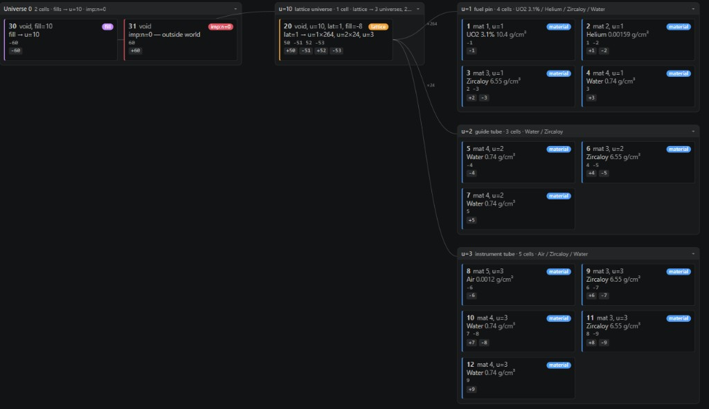
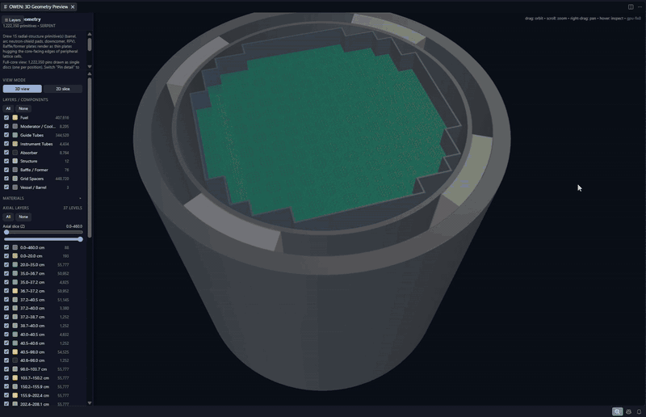

<h1 align="center">OWEN</h1>
<p align="center"><strong>Open Workspace for Engineered Neutronics</strong></p>
<p align="center">Created by <strong>Aaron W. Calhoun</strong></p>
<p align="center">Write, check, convert, and run <strong>MCNP</strong>, <strong>OpenMC</strong>, <strong>Serpent</strong>, and <strong>SCONE</strong> decks in VS Code and Cursor. Language-server diagnostics, a 3D preview of the real geometry, converters between the four codes, a results viewer, and visual lattice / input builders — fully offline.</p>

<p align="center">
  <a href="https://marketplace.visualstudio.com/items?itemName=belvoirdynamics.owen-neutronics"></a>
  <a href="https://marketplace.visualstudio.com/items?itemName=belvoirdynamics.owen-neutronics"></a>
  <a href="https://open-vsx.org/extension/belvoirdynamics/owen-neutronics"></a>
  <a href="https://github.com/caalh/owen/releases/latest"></a>
  <a href="./LICENSE"></a>
</p>

<p align="center">A <a href="https://reactormc.net">BelvoirDynamics</a> product · part of <a href="https://reactormc.net">ReactorMC</a></p>
<p align="center">Get it from the <a href="https://marketplace.visualstudio.com/items?itemName=belvoirdynamics.owen-neutronics">VS Marketplace</a>, <a href="https://open-vsx.org/extension/belvoirdynamics/owen-neutronics">Open VSX</a>, or <a href="https://github.com/caalh/owen/releases">GitHub Releases</a> — the badges above show the current version on each.</p>

---

OWEN is the editor toolkit for MCNP, OpenMC, Serpent, and SCONE. Catch
cross-reference and physics mistakes as you type, hover a nuclide for its
library and temperature, preview the geometry in 3D, convert a deck to
another code, run the solver, and read k-eff without leaving VS Code or
Cursor — and without a network connection.

## See it in action

**Cell Map of an MCNP lattice.** Root universe, the `lat=1` cell, and the three
universes it places — fuel pin, guide tube, instrument tube — with surface
senses, materials, and fill counts, so you can walk a deck the way the code
will. Click a card to jump to the card in the original file.

<p align="center">
  
</p>

**A full BEAVRS core in 3D.** OWEN draws every pin of the nested lattice. Turn
on axial segments to see fuel, plena, and grid spacers as separate layers;
peel off the vessel or slice through the core. Scroll zooms toward whatever
you point at — it no longer leaps from the whole vessel onto a single pin.

<p align="center">
  
</p>

**Geometry checked against your own OpenMC, not against OWEN's opinion of it.**
`OWEN: Verify Geometry with OpenMC` runs the model through your real OpenMC install — local or WSL —
and reports overlapping cells on five sampled planes plus a short lost-particle probe. Overlap
pixels come back highlighted in magenta, and the panel says plainly that sampled planes are
evidence rather than proof.

<p align="center">
  
</p>

**Five highlight palettes per code, previewed side by side before you commit.**
`OWEN: Choose Highlight Palette` shows Classic, Solarized, High Contrast, Pastel,
and Custom on the language you picked. Click a card to apply it. Custom colors
live in `owen.highlight.customColors`.

<p align="center">
  
</p>

## Features

### Write

| Feature | Description |
|---------|-------------|
| **Syntax highlighting** | Grammars and five palettes (Classic, Solarized, High Contrast, Pastel, Custom) for MCNP, OpenMC, Serpent, SCONE, and PHITS. Switch palettes with `OWEN: Choose Highlight Palette`. |
| **Snippets** | Ready-to-edit decks: PWR pin cell, 17×17 PWR assembly, criticality array, and shielding slab for MCNP; full OpenMC pin/assembly Python scripts plus depletion runs (`omc_deplete`, `omc_deplete_results`); SCONE fuel pin, 5×5 assembly, and shielding tutorials; PHITS starter deck, source, material, and T-Track tally blocks. |
| **MC Language Server** | A real language server for MCNP, Serpent, and SCONE: **real-time diagnostics as you type** — density-sign and fraction-sign conventions, S(α,β) thermal scattering on non-hydrogenous materials, ZAID format, macrobody parameter counts, MCNP line length, and **cross-reference errors** (a cell referencing an undefined surface/material/universe/transform is flagged; defined-but-unused entities are faded hints) — plus hover, go-to-definition, find-references, and a grouped document outline (Cells / Surfaces / Materials / Universes / Transforms / Tallies). Ships as a self-contained `out/server.js`, reusable by other editors over stdio. OpenMC Python files keep Pylance plus `OWEN: Validate Input File`. |
| **Nuclide & library hover** | Hover a ZAID and read the nuclide and what its suffix means: `92238.80c` is ENDF/B-VII.1 at 293.6 K (not VIII.0 — that is `.00c`), `.71c` is VII.0 at 600 K and wants a `TMP` card, `lwtr.20t` is H in light water from ENDF71SaB. Serpent and SCONE suffixes are explained as the temperature indices they are; OpenMC `'U235'` strings get the nuclide and the cell > material > settings temperature rule. Class letters follow Table B.1. |
| **MCNP cross-reference tracker** | Role- and position-aware hover, Go-to-Definition, Find-All-References, occurrence highlight, and a **MCNP References** tree for MCNP decks. A number is resolved by *what it is and where it sits on the card* — cell id (1st field), material number (2nd field; `0` = void), geometry surface refs (signed entries), surface id (1st field of a surface card), `u=` universe, `fill`/`lat` (lattice fill arrays are decoded so universe references inside them resolve), `trcl`/`tr` transforms, and `mt`/`mx` material-data cards. Clicking surface `3` finds only the references to *surface 3* — never material 3, cell 3, or the digit `3` inside a `fill=` index. |
| **MCNP workspace validation** | Cross-file diagnostics when `owen.mcnp.projectRoot` is set: undefined references and duplicate IDs across included MCNP decks (`OWEN: Set MCNP Project Root`). |
| **Workspace validation (all codes)** | `OWEN: Validate Workspace` reads the files *next to* the deck and checks that they describe one model. OpenMC XML projects get the checks that matter between files — tally filter bins against the geometry's cell/material/surface/mesh ids, tally `<nuclides>` against the materials, `fill` and lattice universes, `run_mode` against source and fissile content, and `model.xml` against the separate files (OpenMC runs `model.xml` when both exist, so a stale one is an error, a newer separate file a warning). Serpent: `include` resolution, `mat`/`therm`/universe references, `set acelib`. SCONE: `aceLibrary`, materials, cells, universes. OpenMC Python: local imports and whether the exported XML is older than the script. Every language also gets a quick geometry sample (overlaps, lost points). Runs on open and save with a status-bar item; the report lists what was verified. |
| **Deep validation** | On-demand language-aware diagnostics with codes — ZAID format, density/fraction sign conventions, `mt`/S(α,β) target-element checks, macrobody parameter counts (MCNP); `IndependentSource`/`RectangularPrism` API checks, MCNP-style S(α,β) names, density units (OpenMC); `cuboid` vs `rect`, `trcl`, CLI `omp` (Serpent); `aceNeutronDatabase`, temperature-suffix matching, `pinUniverse` radii/fills (SCONE). |
| **OpenMC XML validation** | Live diagnostics on `materials.xml` / `geometry.xml` / `settings.xml` / `tallies.xml` / `model.xml` (detected by root element, so renamed exports work too): duplicate ids, GNDS nuclide-name format, density units, ao/wo conflicts, MCNP-style `sab` names, surface/boundary types, region → surface and cell → material cross-references (against a sibling `materials.xml`), `inactive < batches`, run modes, tally filter references. |

### Build

| Feature | Description |
|---------|-------------|
| **Input Builder** | Snippet wizards for Material, Surface, Cell, Lattice (integrated visual grid editor with W 17×17 / BWR presets and editable identifiers), Source, and Settings — plus a searchable template library. Pick code, add materials from an 18-entry curated library or the searchable **PNNL-15870 Rev. 2 compendium (411 materials)**, pin-cell or lattice geometry, run settings, preview — then insert or open as a new file (`Ctrl+Shift+I`). |
| **Lattice Builder** | Shortcut into Input Builder's Lattice tab — same visual grid editor that generates MCNP / OpenMC / Serpent / SCONE lattice code from a pin map. |
| **Materials (NRDP + PNNL)** | `OWEN: Insert Material from Database` inserts reactor materials rendered for the detected deck language — the curated Nuclear Reactor Data Project set (bundled snapshot, optional live refresh from reactormc.net) plus the full PNNL-15870 Rev. 2 compendium with correct per-code conventions (isotopic ZAIDs with weight fractions for MCNP/Serpent, `add_element`/`add_nuclide` for OpenMC, atom densities for SCONE; S(α,β) only on hydrogenous moderators). **Auto-assigns the next free `mN` (and `mtN`)** from the open deck so inserts do not collide with existing material numbers. |
| **Prebuilt models** | `OWEN: Open Prebuilt Model…` opens bundled, offline reactor decks in a new editor with the correct language. Ships the **complete BEAVRS Cycle-1 full core** (all 193 assemblies, full axial pin stacks, baffle/barrel/shields/RPV) for **all four codes** — MCNP, OpenMC, Serpent, and SCONE — plus 17×17 PWR assembly starters and a **Reflected UO2 Pin Cell** teaching model in all four codes (the OpenMC twin is run-verified: k-inf 1.2256 ± 0.0010). The SCONE full-core deck is the author-verified source of truth; the MCNP/OpenMC/Serpent decks are geometry/materials-faithful translations of it. |
| **Cross-code converter** | `OWEN: Convert Deck…` (`owen.convertDeck`) converts **MCNP ↔ OpenMC** — a high-fidelity engine with a full boolean region AST, multi-level universes and rect/hex lattices, transforms, graveyard handling, and tally/source mapping, validated against the bundled BEAVRS full core in real OpenMC — plus **MCNP → Serpent / SCONE (experimental)**. Anything that can't be mapped emits a clearly marked `TODO(owen-convert)` comment instead of being silently dropped, and results open in a **Rosetta diff** view — source and converted deck side-by-side with aligned cells/surfaces/materials sections and TODO highlights. `OWEN: Convert to OpenMC XML (openmc adapters)` additionally drives the OpenMC team's own converters ([openmc_mcnp_adapter](https://github.com/openmc-dev/openmc_mcnp_adapter), [openmc_serpent_adapter](https://github.com/openmc-dev/openmc_serpent_adapter), both MIT) through your Python as a second opinion — they emit real `openmc.Model` XML for geometry + materials, but ignore source/tally definitions and write placeholder settings, so OWEN flags that in the result. Not bundled; OWEN offers the pip command if one is missing. Measured side-by-side: `docs/ADAPTER_COMPARISON.md`. |

### Visualize & verify

| Feature | Description |
|---------|-------------|
| **3D geometry preview** | Three.js webview (bundled, works offline) rendering of MCNP / OpenMC / Serpent / SCONE geometry with component / material / axial-layer toggles, slice planes, and a Disc/Layers fidelity control. Renders a **full BEAVRS core** (all 193 assemblies) across every code — including OpenMC cores whose lattices are built programmatically (comprehension/dict-driven assembly maps are statically expanded, no Python executed) — without dropping pins, and shows the **full axial stack** for OpenMC too — each pin is reconstructed as its real z-column from the deck's `_SHELLS`/`STACKS`/`R[key]` tables, so grid spacers, plena, end plugs and SS nozzles render with their own per-band shells/materials over the complete 0→460 cm assembly height, matching MCNP/Serpent/SCONE. Geometry is instanced (so draw calls stay low) and a configurable instance budget (`owen.preview.maxInstances`, default 1.5M) auto-simplifies detail (shells→discs, then collapses axial) instead of hiding pins when a deck is huge. **Hover** any part to read its layer, material, axial index, radius/diameter and z-range; **solo** a layer to isolate it; and **measure** distances (with Δx Δy Δz), included angles, and pin/shell radii directly in the view. |
| **Render with OpenMC** | `OWEN: Render with OpenMC (authoritative)` shells out to your actual OpenMC installation and shows OpenMC's own slice plots (xy/xz/yz, origin/width controls, material/cell coloring, optional 3D ray trace on OpenMC ≥ 0.15) in a panel — ground truth straight from OpenMC's geometry kernel, ideal for verifying OWEN's built-in preview or debugging geometry. Finds your interpreter automatically (settings → ms-python → PATH → WSL) and falls back to the built-in preview when OpenMC isn't installed. |
| **Verify Geometry with OpenMC** | `OWEN: Verify Geometry with OpenMC` runs an OpenMC model through your local OpenMC installation and checks for **overlapping cells** (slice plots with overlap detection at several sampled planes) and **lost particles** (a short capped probe run). The results panel shows per-plane images with overlap highlights, the lost-particle report, or a green all-clear — with the honest caveat that sampled planes are evidence, not proof. |
| **Check Geometry / Cell Volumes (built in)** | The same questions answered by OWEN's own exact-geometry engine, for all four codes and with no solver: `OWEN: Check Geometry` samples each universe in its own frame plus the full fill/lattice descent and names the overlapping cell pairs and the gaps (also published as Problems); `OWEN: Cell Volumes` gives stochastic per-instance volumes with errors, masses where a mass density is known, and — for MCNP — the `vol`/`sd` cards that keep an F4/F7 tally on a lattice or infinite cell from being a fatal error. |
| **Source & tally overlays** | The 3D preview draws the deck's `ksrc`/`sdef pos`, OpenMC `stats.Point`/`stats.Box`, Serpent `src sp`/`sx sy sz` and SCONE `pointSource` as markers, and `fmesh` / `RegularMesh` / Serpent `det dx dy dz` as wireframe boxes with their divisions, toggleable. A source point on a surface or a mesh that misses the fuel is visible at once. |
| **ALLEN σ(E) explorer + Doppler Studio** | Built-in cross-section webview: log-log σ(E) plots from ENDF/B-VIII.0, nuclide/reaction picker, multi-overlay, hover readout — with nuclides auto-detected from the active deck. **Doppler Studio** adds multi-temperature overlays (294/600/900/1200 K), a resonance-integral readout, and a Bondarenko σ₀ self-shielding slider. Cross-library comparison (e.g. ENDF/B-VIII.0 vs JEFF-3.3) lives on the companion <a href="https://reactormc.net">reactormc.net</a> ALLEN pages, one click away. |

### Run & analyze

| Feature | Description |
|---------|-------------|
| **Simulation runner** | One-command launcher that starts the right solver (MCNP / OpenMC / Serpent / SCONE) in a dedicated terminal, with per-code executable settings and WSL support for SCONE on Windows. |
| **Results Viewer** | `OWEN: View Results` parses the outputs of **all four codes** (OpenMC `statepoint.h5` via h5wasm + stdout fallback, MCNP `mctal`, Serpent `_res.m`, SCONE `.out`) and shows k-eff convergence, flux spectrum (log-log), a tally table, and mesh heatmaps — mesh tallies can be overlaid on the 3D geometry preview as a colored slice plane. |
| **Parametric sweep + dashboard** | JSON-described parameter sweeps with per-run input mutation, output capture, k-eff parsing, and a manifest + TSV summary — then `OWEN: View Sweep Results` plots k-eff vs the swept parameter with error bars, per-run convergence small-multiples, and a run table. |
| **Community Library** | Browse and insert approved models shared on ReactorMC, filtered to the code you are editing. Enabled by default; disable with `owen.community.enabled`. |
| **Tutorials** | In-editor **ReactorMC search** (`OWEN: Search ReactorMC (Tutorials & NRDP)`) over bundled (and optional live) site index — tutorials, NRDP pages, reactors, and tools open on reactormc.net in one click. |

## Install

**From the VS Code Marketplace:**

1. Open the Extensions view (`Ctrl+Shift+X` / `Cmd+Shift+X`).
2. Search for **OWEN** and click **Install** — or install [`belvoirdynamics.owen-neutronics`](https://marketplace.visualstudio.com/items?itemName=belvoirdynamics.owen-neutronics).

**From Open VSX** (Cursor, VSCodium, etc.): install [`belvoirdynamics/owen-neutronics`](https://open-vsx.org/extension/belvoirdynamics/owen-neutronics).

**From a VSIX** ([GitHub Releases](https://github.com/caalh/owen/releases/latest)):

```bash
code --install-extension owen-neutronics-<version>.vsix
# Cursor:
cursor --install-extension owen-neutronics-<version>.vsix
```

Or in the editor: Extensions view → `...` menu → **Install from VSIX…**.

## Commands

Open the Command Palette (`Ctrl+Shift+P` / `Cmd+Shift+P`) and type **OWEN**:

| Command | Description |
|---------|-------------|
| `OWEN: Open ALLEN Cross-Sections` | σ(E) webview — nuclide/reaction picker, log-log plot, multi-overlay, Doppler Studio |
| `OWEN: Open Input Builder` | Snippet wizards: materials (curated + PNNL), surfaces, cells, lattice, source, settings → starter deck |
| `OWEN: Open Input Builder (Lattice tab)` | Visual lattice grid editor (alias for Lattice Builder) |
| `OWEN: Validate Input File` | Deep MCNP / OpenMC / Serpent / SCONE checks on demand |
| `OWEN: Run Simulation` | Launch the appropriate solver in a dedicated terminal |
| `OWEN: Run Parameter Sweep` | Generate and run a JSON-described sweep |
| `OWEN: View Sweep Results (Dashboard)` | k-eff vs parameter, per-run convergence, run table |
| `OWEN: View Results` | k-eff convergence with a convergence reading (halves test, drift, source-entropy plateau, lost particles), the k-eff estimator table with spreads, Shannon-entropy plot when the run wrote one, MCNP's ten statistical checks row by row, flux spectrum, tallies, mesh heatmaps — all four codes |
| `OWEN: Open 3D Geometry Preview` | Three.js webview — full-core BEAVRS, layer toggles, measurement tools |
| `OWEN: Render with OpenMC (authoritative)` | Native OpenMC slice plots of the active OpenMC Python model (requires OpenMC installed) |
| `OWEN: Verify Geometry with OpenMC` | Overlap + lost-particle checks through your local OpenMC |
| `OWEN: Convert Deck…` | Any of MCNP / OpenMC / Serpent / SCONE to any other. MCNP ↔ OpenMC is stable; Serpent and SCONE → MCNP go through the exact-geometry model (experimental); the remaining pairs pivot through MCNP and carry both hops' TODOs. Rosetta diff view. |
| `OWEN: Convert to OpenMC XML (openmc adapters)` | Second-opinion MCNP/Serpent → OpenMC conversion via the OpenMC team's adapters in your Python (geometry + materials only) |
| `OWEN: Open Prebuilt Model…` | Load a bundled BEAVRS full-core, assembly, or pin-cell deck |
| `OWEN: Show MCNP References (Cross-Reference Tracker)` | Open the MCNP cross-reference tracker dock |
| `OWEN: Show Cell Map` | Structure tree of the fill hierarchy (root → lattices → pins, with placement counts) beside a flowchart of the cells by universe, a path-from-root breadcrumb for any cell, per-cell material/density and bounding surfaces, click to jump to the card. Serpent/SCONE/OpenMC names are kept. MCNP, OpenMC, Serpent, and SCONE. Opens in a new window or a tab (asked each time; `owen.cellMap.openIn` pins it). |
| `OWEN: Validate Workspace (files working together)` | Cross-file check of the whole model, for every code: OpenMC `materials`/`geometry`/`settings`/`tallies.xml` plus `model.xml` (tally filters → cells that exist, nuclides → materials that contain them, `model.xml` vs the separate files — OpenMC runs `model.xml` when both exist), MCNP root + `read`/`copy` includes, Serpent `include` cards / `mat` names / `therm` / `acelib`, SCONE `aceLibrary` / materials / universes / cells, OpenMC Python local imports and stale exports. Runs on open and save (status-bar item), publishes findings to Problems, and the report lists what it verified — so a healthy project shows green instead of silence. |
| `OWEN: Check Geometry (overlaps & gaps)` | Samples every universe in its own frame and the full fill/lattice descent, and reports overlapping cells and points no cell claims — the lost-particle causes — as a report and as Problems on the cell cards. All four codes. |
| `OWEN: Cell Volumes (vol / sd cards)` | Stochastic per-instance cell volumes (and masses where the deck gives a mass density) with one-sigma errors; for MCNP writes the `vol` and `sd` cards an F4/F6/F7 tally on a lattice or infinite cell needs, and inserts them. |
| `OWEN: Compare Geometry with…` | Same model in two decks (any codes): point-sample agreement of the boundaries, material pairing, composition by class, and where they disagree. This is the test that shows whether an MCNP, Serpent, SCONE or OpenMC version of one reactor is really the same reactor. |
| `OWEN: Semantic Diff with…` | Diff two decks by *model* rather than text: both are reduced to a canonical listing (surfaces, cells per universe, fills, materials with normalised fractions) and opened in VS Code's diff viewer, so renumbering and formatting vanish and a changed radius is one line. |
| `OWEN: Set MCNP Project Root` | Root `.inp` for cross-file workspace validation |
| `OWEN: Insert Material from Database` | NRDP + PNNL-15870 material picker, language-aware (auto-numbered `mN`) |
| `OWEN: Search ReactorMC (Tutorials & NRDP)` | In-editor search over reactormc.net tutorials, NRDP, and site tools |
| `OWEN: Choose Highlight Palette` | Switch between Classic / Solarized / High Contrast / Pastel / Custom |
| `OWEN: Toggle Invisible Characters` | Reveal tabs/trailing whitespace that break fixed-format decks |
| `OWEN: Input from Community Library` | Browse approved ReactorMC community models and insert one |
| `OWEN: Open Community Library on reactormc.net` | Open the community library in a browser to upload, rate, or comment |
| `OWEN: Reference Documentation...` | Upstream manuals for the code you have open, plus NNDC / IAEA / JANIS and ReactorMC |

## Configuration

All settings live under the **OWEN** section (`Ctrl+,` → search "owen"):

| Key | Default | Notes |
|-----|---------|-------|
| `owen.mcnp.executable` | `mcnp6` | Path to the MCNP executable |
| `owen.mcnp.lineLengthLimit` | `80` | MCNP card-image column limit (set 128 for MCNP6.2+); drives diagnostics and the editor ruler |
| `owen.serpent.executable` | `sss2` | Path to the Serpent executable |
| `owen.openmc.executable` | `openmc` | Non-Python OpenMC entry point only |
| `owen.openmc.pythonExecutable` | `python` | Interpreter for OpenMC model scripts; when explicitly set it is also the first candidate for `Render with OpenMC` |
| `owen.openmc.crossSections` | *(blank)* | `cross_sections.xml` as the interpreter sees it (a WSL path when OpenMC lives in WSL). Blank means OWEN searches the environment, the openmc config, and the usual install locations |
| `owen.openmc.deckArgs` | *(blank)* | Arguments a model script is run with for `Render with OpenMC` / `Verify Geometry`, e.g. `--preset base`. Also editable in the render panel |
| `owen.scone.executable` | `scone` | On Windows, SCONE typically requires WSL |
| `owen.highlight.<lang>.palette` | `Classic` | Palette for `mcnp` / `openmc` / `serpent` / `scone`. Also settable from `OWEN: Choose Highlight Palette` |
| `owen.highlight.customColors` | `{}` | Colors for the `Custom` palette, per token role (`"keyword": "#FF9100"` or `{foreground, fontStyle}` objects). Unset roles fall back to Classic |
| `owen.highlight.openmc.decorate` | `true` | Draw the OpenMC palette on top of the Python highlighter. Set `false` to leave coloring to Pylance |
| `owen.highlight.openmc.coverage` | `Full deck` | Whether the OpenMC palette also colors Python comments, strings, numbers, keywords and `def`/`class` names, or only OpenMC API names |
| `owen.preview.maxInstances` | `1500000` | Max cylinder instances in the 3D preview; auto-simplifies detail (not pins) above this. Raise (e.g. 4000000) for full shell+axial detail on a full core |
| `owen.cellMap.openIn` | `ask` | Where the Cell Map opens: ask each time, `newWindow`, `beside`, or `activeGroup`. Clicking a cell always reveals the deck's existing tab, never a copy |
| `owen.simulation.workingDirectory` | `""` | Empty = the input file's directory |
| `owen.mcnp.projectRoot` | `""` | MCNP root `.inp` for cross-file workspace validation |
| `owen.mcnp.workspaceValidation.enabled` | `true` | Merge cross-file diagnostics into the language server |
| `owen.mcnp.workspaceValidation.warnUnused` | `true` | Hint on defined-but-unused MCNP entities |
| `owen.nrdp.live` | `true` | Live-fetch NRDP snapshots when online |
| `owen.nrdp.endpoint` | `https://reactormc.net/data` | Base URL for live NRDP JSON |
| `owen.allen.dataBaseUrl` | `https://reactormc.net/data/allen` | Base URL for ALLEN σ(E) JSON; override for offline use |
| `owen.community.enabled` | `true` | Browse the ReactorMC Community Library in the editor |
| `owen.community.webUrl` | `https://reactormc.net/community` | Page opened by `OWEN: Open Community Library on reactormc.net` |
| `owen.supabase.url` | ReactorMC project | Backend for the Community Library; override to browse a different one |
| `owen.supabase.anonKey` | ReactorMC publishable key | Public read-only credential; override alongside the URL |

> The Community Library now points at ReactorMC out of the box. The bundled key is a Supabase
> **publishable** key, which is public by design — Row Level Security restricts it to reading
> *approved* models, and OWEN's client is created with `persistSession: false`, so it cannot sign
> in or write anything. Set `owen.community.enabled` to `false` to stop OWEN contacting the
> backend at all; the bundled prebuilt models and snippets are unaffected either way.
>
> Uploading, rating, and commenting happen on the website — OWEN browses and inserts only.

## Requirements

OWEN is an editor toolkit — it does not bundle the Monte Carlo solvers. To run simulations,
render/verify with OpenMC, install and point the settings above at your own builds of:

- **MCNP** (Los Alamos National Laboratory — export-controlled, requires a license)
- **OpenMC** (open source; run via the Python interpreter you configure)
- **Serpent** (VTT — requires a license)
- **SCONE** (University of Cambridge — open source; on Windows it typically runs under **WSL**)

Syntax highlighting, snippets, the language server, validation, the lattice/input builders,
the converter, prebuilt models, ALLEN, and the built-in geometry preview all work without
any solver installed.

## Supported languages

| Language | Highlighting | Snippets | Diagnostics | Runner |
|----------|--------------|----------|------------|--------|
| MCNP | Yes (4 palettes) | Yes | Real-time (LSP) + on-demand | `mcnp6 inp=…` |
| OpenMC (Python) | Decorations + injection grammar (4 palettes) | Yes | On-demand (deep) + Pylance | `python <file>` |
| Serpent | Yes (4 palettes) | Yes | Real-time (LSP) + on-demand | `sss2 <file>` |
| SCONE | Yes (4 palettes) | Yes | Real-time (LSP) + on-demand | `scone <file>` (WSL on Windows) |
| OpenMC XML | VS Code's XML | — | Live (extension host) | — |
| PHITS | Yes | Yes | — (highlighting + snippets only) | — |

**PHITS is a syntax-only tier, by decision.** OWEN's diagnostics, 3D preview, Cell Map, geometry
tools and converter are built on a shared exact-geometry engine for MCNP, OpenMC, Serpent and
SCONE. PHITS gets the grammar and snippets (which are useful on their own) and the reference
links, and nothing that would imply a physics check has been done. That is a deliberate scope
line, not an oversight; it will move only if PHITS users ask for a specific tool.

### Notebooks

OpenMC models are often built in Jupyter. Every OWEN command that reads a deck — 3D preview,
Cell Map, Validate, Convert, Check Geometry, Cell Volumes, Compare, Semantic Diff — accepts a
notebook cell and treats **all code cells of that notebook, joined in order**, as the deck.
Click-to-reveal and diagnostics map back to the owning cell. The live OpenMC export path needs a
file, so for notebooks call `model.export_to_model_xml()` once and OWEN reads the sibling
`model.xml`.

### Offline

OWEN works with no network. Three.js (3D preview) and uPlot (Results, ALLEN, Sweep dashboard)
ship inside the VSIX under `media/vendor/`; nothing is fetched from a CDN. ALLEN's σ(E) curves
and the live NRDP/Community data are the only network features, and each has an offline fallback
or an off switch.

## Acknowledgements

OWEN integrates with **[OpenMC](https://openmc.org)** (MIT License, © OpenMC contributors) for
the `Render with OpenMC (authoritative)` and `Verify Geometry with OpenMC` features — the images
and checks in those panels are produced by your locally installed OpenMC, not by OWEN. OpenMC
itself is not bundled or redistributed.

The optional adapter convert backend (`OWEN: Convert to OpenMC XML (openmc adapters)`) drives
the OpenMC team's own converters, **[openmc_mcnp_adapter](https://github.com/openmc-dev/openmc_mcnp_adapter)**
and **[openmc_serpent_adapter](https://github.com/openmc-dev/openmc_serpent_adapter)** (both MIT
License, © OpenMC contributors), through your Python environment. Neither adapter is bundled or
redistributed — OWEN offers the pip install command when one is missing. OWEN's built-in
converter is an independent implementation; the adapters serve as a second opinion
(`docs/ADAPTER_COMPARISON.md`).

Compendium material data derives from **PNNL-15870 Rev. 2** (April 2021): R.S. Detwiler,
R.J. McConn Jr., T.F. Grimes, S.A. Upton, E.J. Engel, *Compendium of Material Composition Data
for Radiation Transport Modeling*, PNNL. https://doi.org/10.2172/1782721 — via the PyNE
`materials-compendium` export (BSD-2-Clause).

## Related

- **[ReactorMC](https://reactormc.net)** — tutorials, the community library, ALLEN cross-section pages, and the NRDP material data that powers OWEN.
- **GROVES** — the companion desktop editor for the same input languages.
- **[NICHOLS](https://github.com/caalh/nichols)** — Sublime Text and Notepad++ packages for the same languages.

## License

[MIT](./LICENSE) © 2026 BelvoirDynamics.
